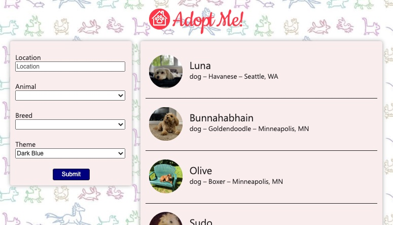

# Adopt Me

### A demo for a web app to search for pet adoptions, built from the ground up using React, Tailwind, React Router, Babel, and ESLint.

---



---

## Installation

Use the package manager [npm](https://www.npmjs.com/) to install. From the root directory:

```bash
npm install
npm run dev
```

# License

The content is licensed under CC-BY-NC-4.0.

The code is licensed under Apache 2.0.

A project for [Modern University](https://www.modernuniversity.io/).
Thanks to [Brian Holt](https://github.com/btholt) and [FrontEnd Masters](https://frontendmasters.com/courses/complete-react-v7/)
